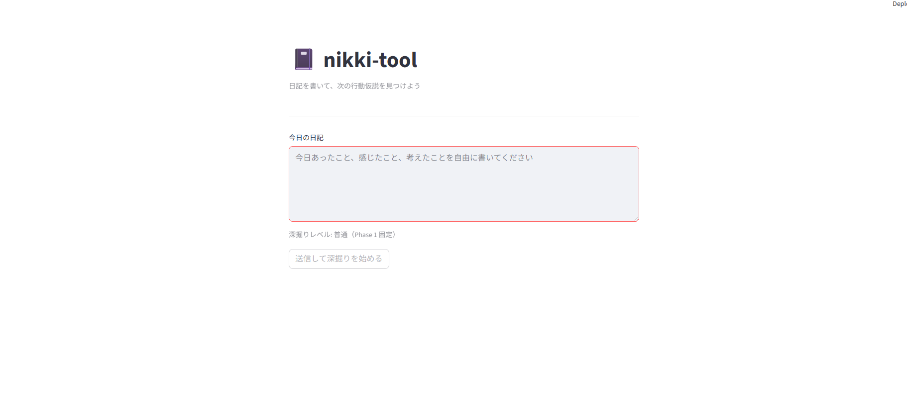
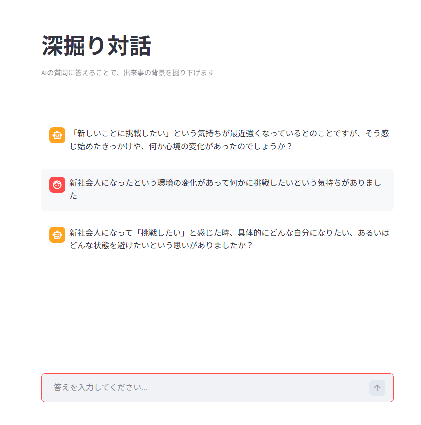
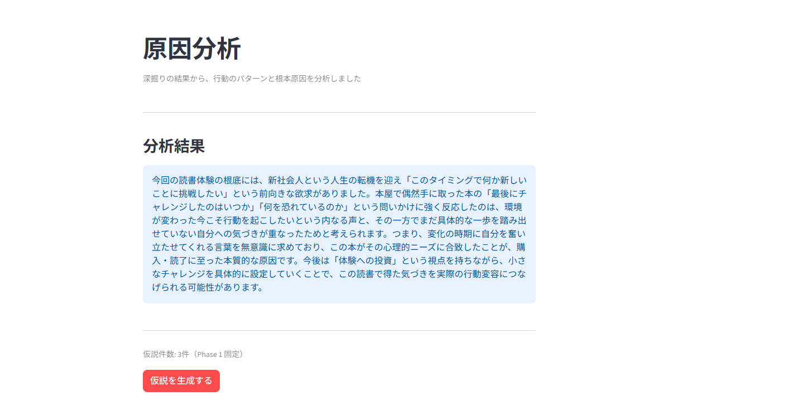
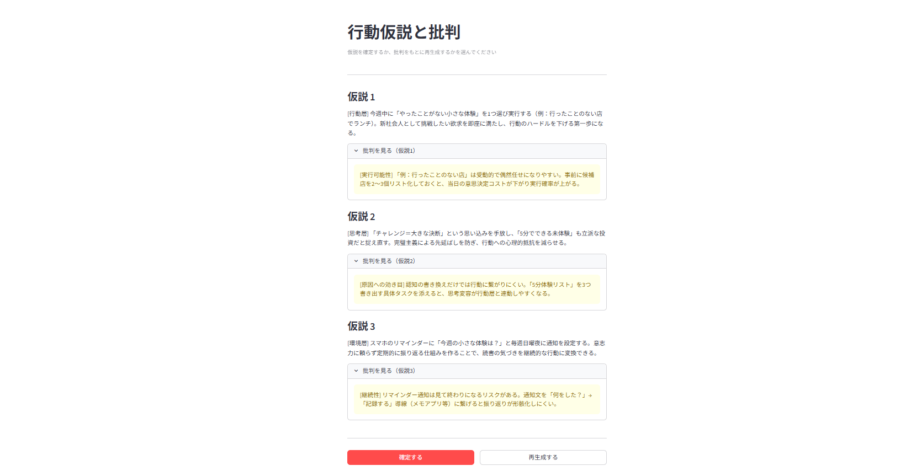
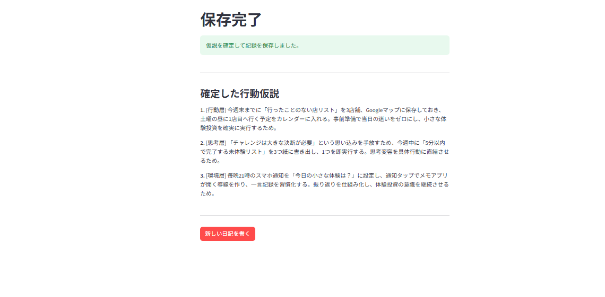

# 🌱 個人成長記録ツール
> 現在、マルチエージェント構成への作り直しを進めています。
> 設計の詳細は [DESIGN.md](./DESIGN.md) に書いています。
## このツールを作った背景

社会人として日報を書く中で、「記録を会社に提出するだけで終わっている」という課題を感じていた。
自分の成長・感情・気づきを**自分自身のために**蓄積・分析するツールが欲しいと思い開発した。

会社の日報ツールとの違いは「誰のための記録か」という点。
このツールは完全に**自分の経験値を最大化するため**のものです。

## 特徴

- **対話形式のコーチング**：AIが答えの深さを判断して次の質問を決める。浅い答えには深掘りを返す
- **経験値の最大化**：単調な報告ではなく、自分でも気づいていなかった学びを引き出す体験
- **記録の蓄積**：対話の内容とまとめをJSONで保存。続けるほど自分のデータが積み重なる
## 設計の考え方

このツールで一番やりたいことは「書いた内容を次の行動につなげる」ことです。

日々の記録は、書いただけでは経験値にならないと思っています。書いた内容を深掘りして原因を理解して、次にどう動くかの仮説まで作るところを、AIに手伝わせたい。それがこのツールの目的です。

### マルチエージェント構成にしている理由

役割を分けた3つのエージェントで動かしています:

- **深掘り・分析エージェント**:対話しながら情報を引き出して、原因を分析する
- **生成エージェント**:次の行動の仮説を複数考える
- **批判エージェント**:出てきた仮説に対してツッコミを入れる

仮説を作るのと、それにツッコミを入れるのを別のエージェントに分けています。同じエージェントに両方やらせると、自分の出した仮説に甘くなってしまう気がして、分けることにしました。

## 使い方

### 必要なライブラリをインストール
pip install anthropic python-dotenv streamlit

### APIキーを設定

`.env`ファイルを作成して以下を記述：
API_KEY=自分のClaude APIキー

### Webアプリ版を起動（推奨）
python -m streamlit run app.py

ブラウザで `http://localhost:8501` が開きます。

### ターミナル版を起動
python nikki.py

## 動作イメージ（v2：マルチエージェント構成）

### 入力画面

日記を入力して深掘りを開始します。

### 深掘り対話

AIが対話形式で情報を引き出します。浅い回答には深掘り、具体的な回答には別の角度から質問が返ってきます。

### 原因分析

深掘りが完了すると、行動の背景にある原因を分析した結果が表示されます。この分析をもとに行動仮説を生成します。

### 行動仮説と批判

行動層・思考層・環境層の3つの視点から仮説が生成され、それぞれに対して批判エージェントがツッコミを入れます。納得できなければ批判を踏まえて再生成できます。

### 保存完了

確定した仮説がDBに保存されます。

## 開発計画

### Phase 1(進めているところ):マルチエージェント構成への作り直し
- 記録用DBの構築
- 3つのエージェントの実装
- 最小限のUIで動かす

### Phase 2:機能を増やす
- 深掘りレベルを選べるようにする(浅い/普通/深い)
- 仮説の件数をユーザーが選べるようにする
- 仮説を作り直すループ
- 過去の記録を検索できるようにする

### Phase 3:いつかやりたいこと
- 立てた仮説を実際にやってみた結果を追跡する
- 過去の日記と照らし合わせた分析
- スマホ対応
## 使用技術

- Python 3.14
- Claude API (Anthropic)
- Streamlit
- python-dotenv

## 関連ドキュメント

- [DESIGN.md](./DESIGN.md) - 要件、アーキテクチャ、設計のときに考えたこと